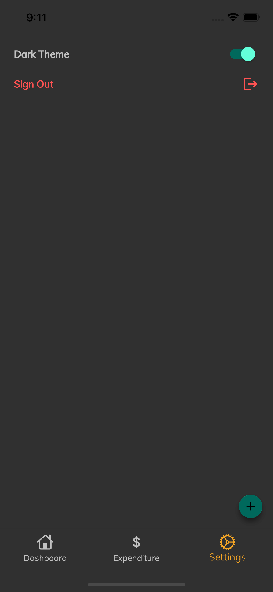

# expense_tracker
Flutter SDK should have been set up preferably versions >=2.18.4 <3.0.0
1. Unzip file
2. Open in code editor
3. Run "Flutter pub get"

APK can be found under build/app/outputs/flutter-apk/app-armeabi-v7a-release.apk

Authentication

Settings

Expenditure

Dashboard

